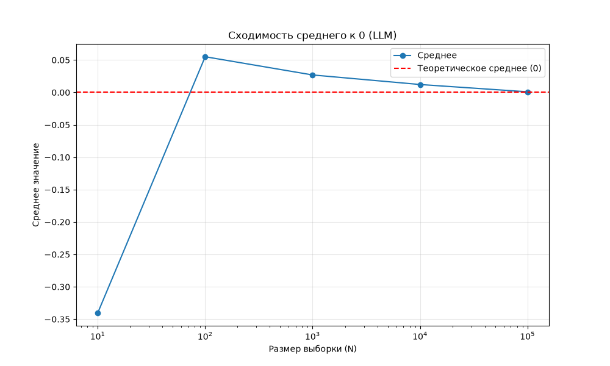

# Monte Carlo Engine — Стадия 1

Данный проект проверяет действие **закона больших чисел** на практике с помощью метода **Монте-Карло**.

## Идея проекта

При увеличении размера выборки среднее значение по выборке стремится к **0**, поскольку исходные данные распределены нормально с параметрами:
- среднее = 0
- стандартное отклонение = 1

## Результаты

График показывает, как среднее значение приближается к теоретическому среднему (0) при росте выборки.



## Запуск

Установи зависимости:

```bash
pip install -r requirements.txt